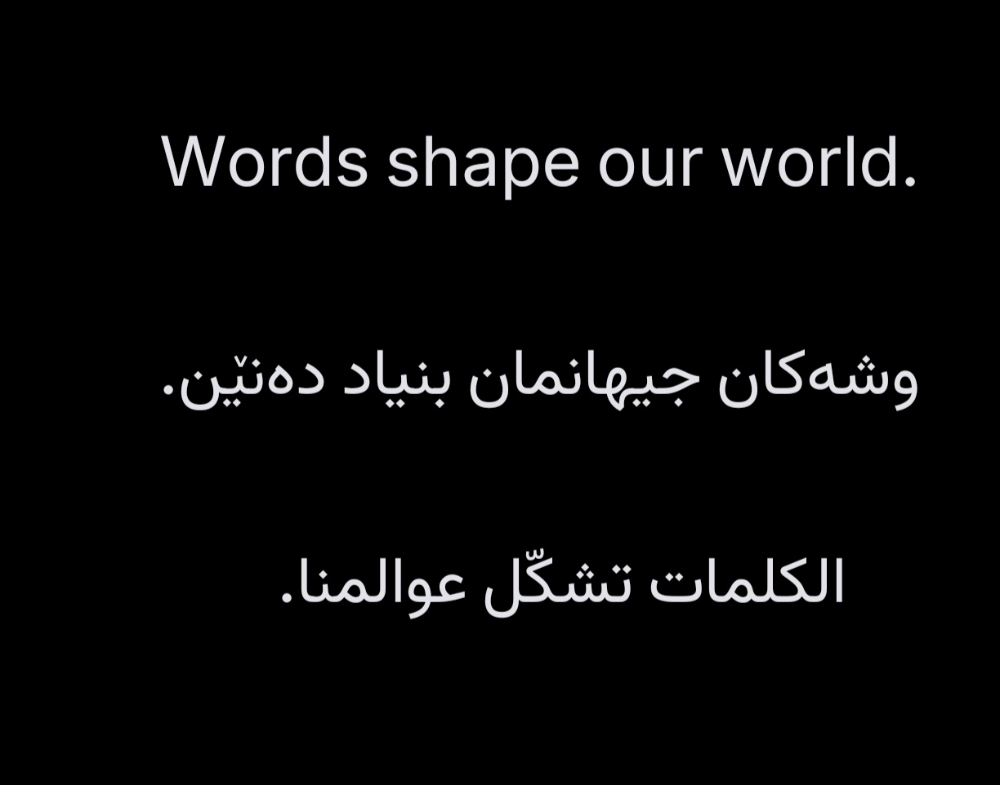

# VazirInter Omer

A modern, high-legibility hybrid font engineered for seamless optical balance between **Kurdish Sorani**, **Arabic**, and **English**.

  

Download ready-to-use fonts directly from [Releases](https://github.com/OmerKurdi79/vazirinter-omer-font/releases).

---

## English

### Highlights
- **Kurdish Sorani & Arabic**: Built on **Vazirmatn** with complete, unbroken native ligatures (`ڕ`, `ڵ`, `ۆ`, `ێ`, `ە`).
- **English / Latin**: Powered by **Inter** (SF Pro aesthetic) with balanced letter spacing.
- **Optical Scale**: Custom vector geometry ensuring English and Arabic/Kurdish appear at natural, equivalent optical proportions.
- **Web Formats**: Includes `.woff2`, `.woff`, `.ttf`, and `style.css` for instant website embedding.

### Download
Grab `VazirInter-Omer.ttf`, `.woff2`, or `.woff` from the [Releases](https://github.com/OmerKurdi79/vazirinter-omer-font/releases) page.

---

## کوردی سۆرانی (Kurdish Sorani)

### تایبەتمەندییەکان
- **کوردی و عەرەبی**: لەسەر بنەمای **Vazirmatn** بە بەستنەوەی بێ کێشەی سەرجەم پیتە کوردییەکان (ڕ، ڵ، ۆ، ێ، ە).
- **ئینگلیزی**: بەکارهێنانی فۆنتی مۆدێرنی **Inter** بە ڕوونییەکی بەرز و بۆشایی گونجاوی پیتەکان.
- **هاوسەنگی**: قەبارەی بینراوی هەردوو زمان لە پۆست و دەقەکاندا تەواو هاوتا و یەکسان کراوە.
- **فۆرماتی وێب**: فایلەکانی `.woff2` و `.woff` ئامادەکراون بۆ بەکارهێنان لە ماڵپەڕەکان.

### داگرتن
فایلەکانی فۆنتەکە لە بەشی [Releases](https://github.com/OmerKurdi79/vazirinter-omer-font/releases) بەردەستە بۆ داگرتن.

---

## License
Licensed under the [SIL Open Font License 1.1](LICENSE).
